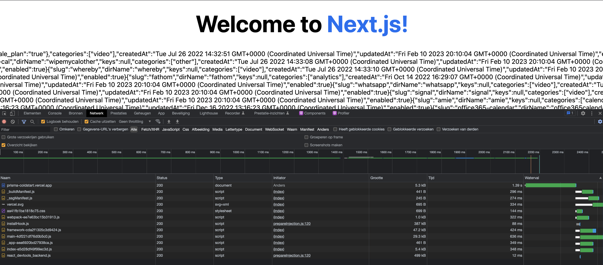
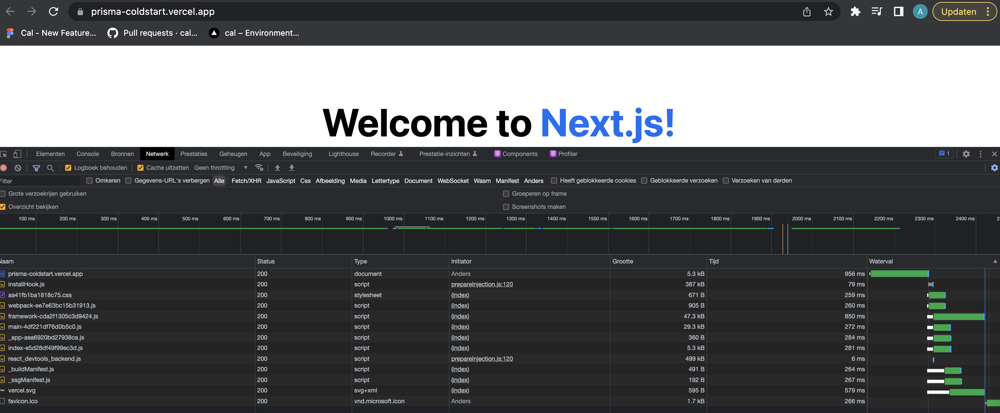

# This is a boiler plate project with the goal of isolating prisma related cold-start performance timings

## Cold boot time benchmark with jsonProtocol=false

Cold boot time on a barebones project with only prisma is 1.4 seconds. This is consistent with @Efrain's findings on our Cal.com repository but eliminates the chance for side-effects. I'm counting .4s from that to be due to NextJS.

**Conclusion**: 1 second of our cold boot time is attributable to Prisma without enabling jsonProtocol.

## Cold boot time benchmark with jsonProtocol=true

The cold boot time on the same project improves to 1 second.  

**Conclusion**: jsonProtocol improves the Prisma related cold start time by 400ms to only 600ms attributable to Prisma. I believe this to be the minimum possible cold boot time on our data model.

## Conclusions of this experiment

We can now conclude that Prisma is not a primary cause of our cold boot issues. The cold boot time is confirmed to be increased by Prisma, however, this portion is reasonable, accounting for less than 1/10th of our total cold boot time.

These findings are consistent with the experiments by @keithwillcode and @roae.
